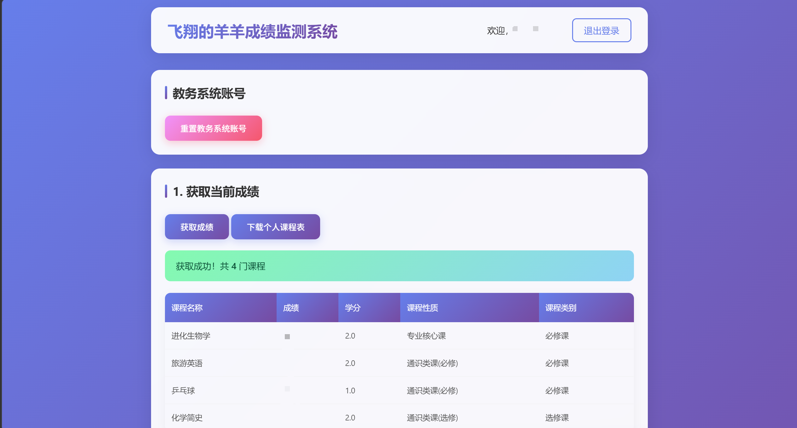
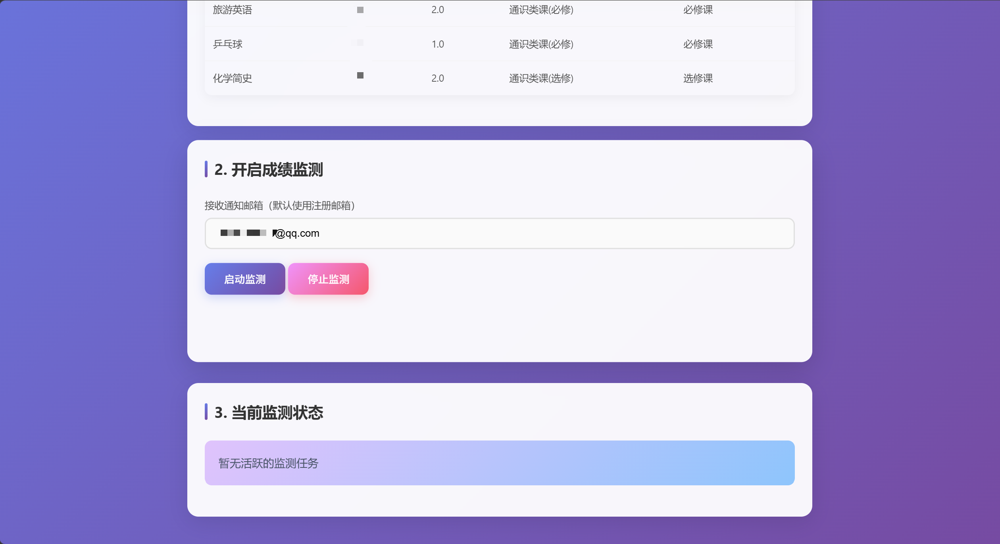
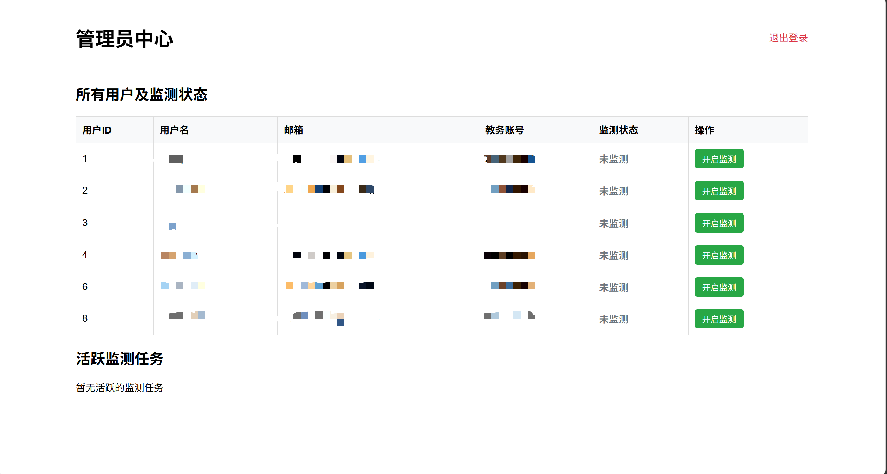

# 正方教务系统成绩监测

一个基于 Flask 的新正方教务系统成绩监测工具，支持自动检测新成绩并通过邮件通知用户。

## 功能特性

- 📚 **成绩查询** - 支持查询历史成绩和最新成绩
- 🔔 **自动监测** - 定时监测教务系统，发现新成绩自动通知
- 📧 **邮件通知** - 通过QQ邮箱发送成绩通知邮件
- 📅 **课程表下载** - 支持下载课程表PDF文件
- 👤 **用户管理** - 支持用户注册、登录和个人信息管理
- 🔧 **管理员面板** - 支持管理员查看和管理所有监测任务

## 技术栈

- **后端**: Flask 2.3.3
- **前端**: HTML + JavaScript + Bootstrap
- **数据库**: JSON文件存储
- **邮件服务**: QQ邮箱 SMTP
- **教务系统对接**: 模拟登录 + API调用

## 项目结构

```
grade_monitor/
├── app.py              # Flask应用主文件
├── config.py           # 配置文件（邮箱、教务系统、应用设置）
├── login.py            # 教务系统登录模块
├── zfn_api.py          # 教务系统API封装
├── mail_send.py        # 邮件发送模块
├── requirements.txt    # Python依赖列表
├── templates/          # HTML模板
│   ├── index.html      # 主页
│   ├── login.html      # 用户登录
│   ├── register.html   # 用户注册
│   ├── admin.html      # 管理员面板
│   └── admin_login.html # 管理员登录
├── users_data.json     # 用户数据（自动生成）
├── monitoring_tasks.json # 监测任务数据（自动生成）
├── api_cookies.json    # 登录Cookie（自动生成）
└── docs/               # 文档和截图
    ├── screenshot_index.png    # 主页截图
    └── screenshot_admin.png    # 管理员面板截图
```

## 快速开始

### 环境要求

- Python 3.8+
- QQ邮箱（用于发送邮件通知）

### 安装步骤

1. **克隆项目**
   ```bash
   git clone <repository-url>
   cd grade_monitor
   ```

2. **安装依赖**
   ```bash
   pip install -r requirements.txt
   ```

3. **配置文件**

   编辑 `config.py` 文件，填写以下配置：

   ```python
   # QQ邮箱配置
   MAIL_CONFIG = {
       "smtp_server": "smtp.qq.com",
       "smtp_port": 587,
       "smtp_tls": True,
       "sender_email": "your_qq@qq.com",      # 你的QQ邮箱
       "sender_password": "your_auth_code"    # QQ邮箱授权码
   }

   # 教务系统配置
   JIAOWU_CONFIG = {
       "base_url": "http://your-jiaowu-url",  # 教务系统URL
       "default_year": 2025,                  # 默认学年
       "default_term": 2                      # 默认学期（1/2）
   }

   # 应用配置
   APP_CONFIG = {
       "secret_key": "your-secret-key",       # 会话密钥
       "admin_password": "admin-password",    # 管理员密码
       "admin_email": "admin@example.com",    # 管理员邮箱
       "monitoring_interval_minutes": 30,     # 监测间隔（分钟）
       "session_lifetime_seconds": 3600 * 24  # 会话有效期（秒）
   }
   ```

   > **QQ邮箱授权码获取方法**：登录QQ邮箱 → 设置 → 账户 → POP3/IMAP/SMTP/Exchange/CardDAV/CalDAV服务 → 开启SMTP服务 → 获取授权码

4. **运行应用**
   ```bash
   python app.py
   ```

   应用将在 `http://127.0.0.1:5002` 启动

## 使用说明

### 用户功能

1. **注册账号** - 访问 `/grade/user/register` 注册新用户
2. **登录系统** - 访问 `/grade/user/login` 登录
3. **查询成绩** - 在主页输入教务系统账号密码，点击查询成绩
4. **开启监测** - 输入教务系统账号密码和通知邮箱，点击开启监测
5. **停止监测** - 在监测状态中选择要停止的监测任务

### 管理员功能

1. **登录管理员** - 访问 `/grade/admin/login`
2. **查看用户** - 查看所有注册用户
3. **管理监测** - 启动/停止指定用户的监测任务

## 功能截图

### 主页截图




### 管理员面板截图



## 配置说明

### 监测频率

修改 `config.py` 中的 `monitoring_interval_minutes` 参数调整监测频率，默认每30分钟检查一次。

### 学期配置

修改 `config.py` 中的 `default_year` 和 `default_term` 参数设置默认学期：
- `default_year`: 学年（如 2025 表示 2025-2026学年）
- `default_term`: 学期（1 表示第一学期，2 表示第二学期）

### 邮箱配置

确保已正确配置QQ邮箱SMTP服务：
- SMTP服务器：`smtp.qq.com`
- SMTP端口：`587`（TLS）
- 使用授权码而非密码登录

## 部署指南

详见 [README_DEPLOY.md](README_DEPLOY.md)

## 注意事项

1. 请确保教务系统URL可以正常访问
2. QQ邮箱需要开启SMTP服务并获取授权码
3. 监测任务会自动保存，重启应用后会自动恢复
4. 用户密码和教务账号密码会进行加密存储
5. 建议使用PM2等进程管理器部署到生产环境

## License

MIT License
